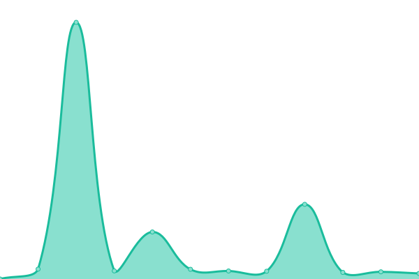

# [📈 Live Status](https://lucienkerl.github.io/status): <!--live status--> **🟧 Partial outage**

This repository contains the open-source uptime monitor and status page for [Lucien Kerl](https://lucienkerl.github.io/status), powered by [Upptime](https://github.com/upptime/upptime).

With [Upptime](https://upptime.js.org), you can get your own unlimited and free uptime monitor and status page, powered entirely by a GitHub repository. We use [Issues](https://github.com/lucienkerl/status/issues) as incident reports, [Actions](https://github.com/lucienkerl/status/actions) as uptime monitors, and [Pages](https://lucienkerl.github.io/status) for the status page.

<!--start: status pages-->
<!-- This summary is generated by Upptime (https://github.com/upptime/upptime) -->
<!-- Do not edit this manually, your changes will be overwritten -->
<!-- prettier-ignore -->
| URL | Status | History | Response Time | Uptime |
| --- | ------ | ------- | ------------- | ------ |
|  [Synology](https://synology.kerl.io) | 🟩 Up | [synology.yml](https://github.com/lucienkerl/status/commits/HEAD/history/synology.yml) | 

 1048ms
     
 | 

<a href="https://status.kerl.io/history/synology">98.59%</a>
    

|  [Bitwarden](https://bitwarden.kerl.io) | 🟩 Up | [bitwarden.yml](https://github.com/lucienkerl/status/commits/HEAD/history/bitwarden.yml) | 

 594ms
     
 | 

<a href="https://status.kerl.io/history/bitwarden">98.60%</a>
    

|  [Nextcloud](https://nextcloud.kerl.io) | 🟩 Up | [nextcloud.yml](https://github.com/lucienkerl/status/commits/HEAD/history/nextcloud.yml) | 

 1002ms
     
 | 

<a href="https://status.kerl.io/history/nextcloud">98.61%</a>
    

|  [Loxone](http://loxone.kerl.io) | 🟩 Up | [loxone.yml](https://github.com/lucienkerl/status/commits/HEAD/history/loxone.yml) | 

 910ms
     
 | 

<a href="https://status.kerl.io/history/loxone">92.33%</a>
    

|  [Cam-85](http://lucien.kerl.io:85) | 🟩 Up | [cam-85.yml](https://github.com/lucienkerl/status/commits/HEAD/history/cam-85.yml) | 

 461ms
     
 | 

<a href="https://status.kerl.io/history/cam-85">98.64%</a>
    

|  Network | 🟥 Down | [network.yml](https://github.com/lucienkerl/status/commits/HEAD/history/network.yml) | 

 0ms
     
 | 

<a href="https://status.kerl.io/history/network">0.00%</a>
    

<!--end: status pages-->

[**Visit our status website →**](https://lucienkerl.github.io/status)

## 📄 License

- Powered by: [Upptime](https://github.com/upptime/upptime)
- Code: [MIT](./LICENSE) © [Lucien Kerl](https://lucienkerl.github.io/status)
- Data in the `./history` directory: [Open Database License](https://opendatacommons.org/licenses/odbl/1-0/)
